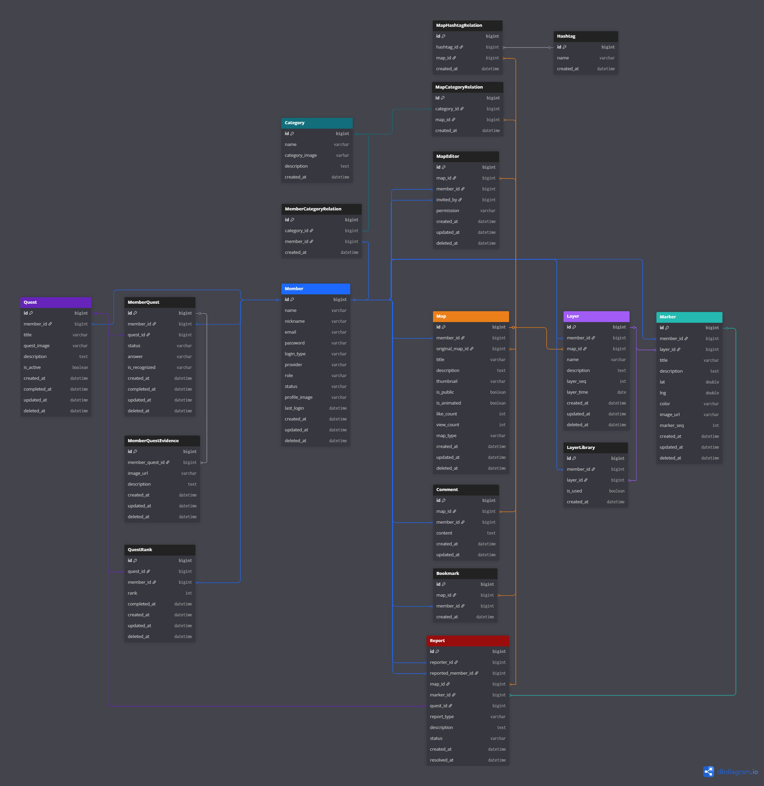

## 🌍 프로젝트 개요

### 🔗 링크
- [GitHub - MAPICK BE-ver1](https://github.com/prgrms-web-devcourse-final-project/WEB5_6_GitSunJaeAb_BE)  <!-- TODO: 백엔드 저장소 링크 -->
- [GitHub - MAPICK FE-ver1](https://github.com/prgrms-web-devcourse-final-project/WEB4_5_GitSunJaeAb_FE)  <!-- TODO: 프론트엔드 저장소 링크 -->
- [GitHub - MAPICK BE-ver2](https://github.com/SOOBAK-mapick-ver2/MAPICK_BE)  <!-- TODO: 백엔드 저장소 링크 -->
- [GitHub - MAPICK FE-ver1](https://github.com/SOOBAK-mapick-ver2/MAPICK_FE)  <!-- TODO: 프론트엔드 저장소 링크 -->
- [일정 관리- ver1](https://github.com/prgrms-web-devcourse-final-project/WEB5_6_GitSunJaeAb_BE/issues) 

### 📝 개요
**MAPICK** 은 사용자가 직접 만든 **커스텀 지도(POI 레이어)** 를 공유하고,  
위치 기반 댓글·좋아요·북마크·퀘스트를 통해 **위키형 커뮤니티**를 구성하는 서비스입니다.

- **ver 1 (완료)**  
  - Google My Maps 기반 사용자 지도 등록·공유
  - 레이어/마커·댓글/좋아요/북마크 API 구현
  - 기본 JWT 인증, 단일 서버 배포

- **ver 2 (진행 중)**  
  - 🔑 **Redis 기반 JWT 리프레시 토큰·블랙리스트** 구현
  - 🚀 **Docker + GitHub Actions + GCP VM** CI/CD 파이프라인 구축
  - 🕸️ **분산 락·TTL** 적용으로 중복 토큰 재발급 방지
  - 📊 JMeter 부하 테스트 및 성능 개선
  - 향후 **Kubernetes 클러스터 배포** 준비

### 💡 진행 배경
- 사용자가 **개인 지도를 자유롭게 공유·구독**할 수 있는 플랫폼 부재
- 실시간·대규모 요청을 처리할 **확장성 있는 백엔드 구조 학습**  
- Redis, Docker, CI/CD 등 **실무형 인프라 스택**을 프로젝트에 적용·검증하기 위함

### ⏳ 기간 / 👥 인원
- **Ver1** : 2025.06.26 ~ 2025.07.31 (약 5주)  
- **Ver2** : 2025.08.16 ~ 진행 중  
- **팀 프로젝트 (백엔드 5명 / 프론트 4명)**  

### 👨‍💻 본인 역할
- **백엔드 리드** (JWT 인증·인가, Redis 토큰 관리)
- Redis 기반 **분산 락·토큰 블랙리스트·TTL** 구현
- GCP VM 환경 세팅 및 배포
- API 스펙 및 ERD 설계 주도

---

## 🗂️ ERD 
   <!-- TODO: 실제 ERD 이미지 -->

---

## 🛠️ 사용 기술 및 라이브러리

### 💻 Backend

  
  
  
  
  
  
  
  

### ☁️ Infra / DevOps

  
  
  

### 🧰 Tools & ETC

  
  

---

## 📌 담당 기능

### 🟢 Ver1 (2025.06.26 ~ 2025.07.31)
- **백엔드 개발 전반**
  - **JWT + Spring Security** 기반 로그인/인가 구현
  - 사용자 **회원·신고** API 설계 및 일부 엔드포인트 개발
  - ERD 초안 작성 및 팀 코드 컨벤션 수립
- **팀 협업 & 운영**
  - 백엔드 **팀 리드** 역할: PR 리뷰, GitHub Issues/Projects로 작업 분배
  - 프론트엔드와 **API 스펙 협의 및 문서화**
  - 단일 서버 환경에서 **배포 및 기본 모니터링** 진행

---

### 🟠 Ver2 (2025.08.16 ~ 진행 중)
- **인증/인가 고도화**
  - **Redis 기반 Refresh 토큰 저장·블랙리스트·TTL 관리** 전면 구현
  - **분산 락** 적용으로 중복 토큰 재발급 방지
- **DevOps & 인프라**
  - **Docker 멀티스테이지 빌드** 작성
  - **GitHub Actions → GCP VM** 자동 배포 CI/CD 파이프라인 구축 

---

## ✨ 결과 & 회고

- **ver 1 결과**
  - JWT 인증 및 단일 서버 배포 완료

- **ver 2 진행 현황**
  - Redis 기반 토큰 관리 
  - CI/CD 파이프라인 구축 **진행 중**
  - Kubernetes 기반 확장 배포 **진행 중**

- **잘한 점 ✅**
  - 초기부터 **CI/CD·Redis 등 인프라 요구사항을 명확히 정의**하고 실험
  - 분산 락 적용으로 **중복 토큰 재발급 방지**

- **아쉬운 점 ❗**
  - 프론트/백엔드 통합 테스트와 모니터링 툴 적용은 현재 진행 중
  - 프로젝트 초기에 문서화를 더 세밀히 했으면 협업 효율이 높았을 것

- **배운 점 📚**
  - **Redis TTL·분산 락**을 통한 실시간 인증 처리 경험

---

## ⚠️ 트러블 슈팅

### 🟢 Ver1 (2025.06.26 ~ 2025.07.31)

#### JWT 만료·인증 필터 처리
- **문제**  
  - Access Token 만료 시 간헐적으로 401 오류가 발생하고,  
    Security FilterChain 에서 예외 처리가 일관되지 않음.
- **원인**  
  - `OncePerRequestFilter` 구현이 미흡해 토큰 만료와 검증 로직이 분리돼 있었음.
- **해결**  
  - 커스텀 `JwtAuthenticationFilter` 로직을 재구성하고,  
    예외 처리 및 만료 응답 코드를 일원화.
- **결과**  
  - 모든 API 호출에서 토큰 만료/재로그인 흐름이 안정적으로 동작.

---

### 🟠 Ver2 (2025.08.16 ~ 진행 중)

#### Refresh/Access 토큰 구조 리팩토링 & Redis 도입
- **문제**  
  - 초기 Ver1 방식(DB/메모리 기반)으로는 동시 요청과 다중 서버 확장 시  
    토큰 무효화·재발급 관리가 어렵고, 레이스 컨디션 위험이 있었음.
- **해결**  
  - **Redis 기반**으로 Refresh Token 저장, 블랙리스트, TTL 관리 구조로 전면 변경.  
  - `SETNX` 기반 **분산 락**을 적용해 중복 토큰 재발급을 방지.  
  - Access/Refresh 재발급 플로우를 전체 리팩토링.
- **결과**  
  - 무중단 배포 및 확장 환경에서도 안전한 토큰 인증·갱신 보장.

